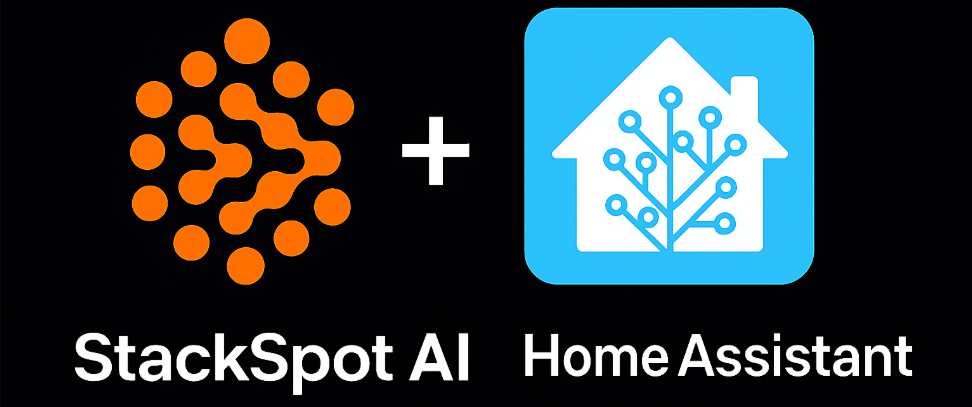
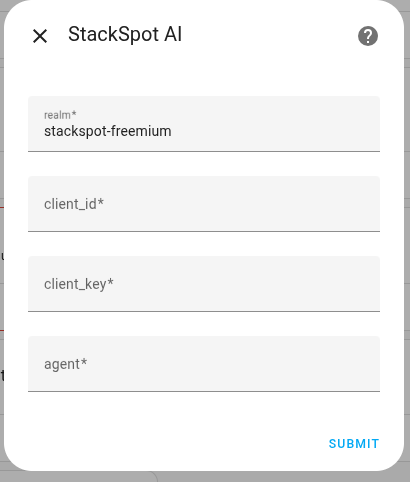
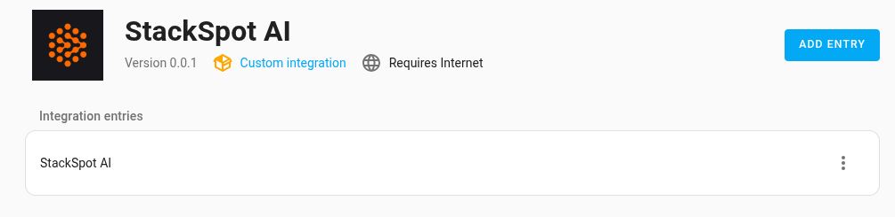

# Integration StackSpot AI with Home Assistan

## 📢 DOCUMENTAÇÃO EM DESENVOLVIMENTO

### O que é
Está é uma integração do Home Assistant para conectar-se à plataforma [StackSpot AI](https://ai.stackspot.com/?campaignCode=01JXZTS2JEQA9H6Z5Y7X52YGR9), 
que é uma plataforma de AI, onde você pode criar com facilidade seus agentes customizados com vários modelos distintos.

### Requisito

Você apenas deve ter uma conta na plataforma StackSpot: [criar conta freemium com 2M de tokens](https://ai.stackspot.com/?campaignCode=01JXZTS2JEQA9H6Z5Y7X52YGR9)

### Funcionalidades
No momento a integração cria um `Conversation agent` o que te permite interagir com seu agente da StackSpot por meio da 
interface do Home Assistant.

### Instalação
A integração está em processo para ser adicionada por padrão no HACS, mas você pode adicionar ela adicionando o repositório
diretamente ao seu HACS, basta clicar no botão a seguir:

### Configuração
Após adicionar e instalar a integração, configure com:

- `realm`: (ex: stackspot-freemium)
- `client_id` e `client_key`: são credenciais para acessar sua conta, e podem ser adquiridas [aqui](https://myaccount.stackspot.com/profile/access-token).
- `agent`: ID do agente que deseja usar, [aqui](https://www.linkedin.com/pulse/seu-agente-de-ia-do-jeito-igor-moreira-nhu6f/) pode ver como criar um.

Então tera algo como:

Agora vá até o `Assistants` e clique em `+ ADD ASSISTANT`:

Veja que pode definir um nome para seu assistant, e em `Conversation agent` você terá uma nova opção:

Após criado basta utilizar o atalho `a` que a interface de conversação será aberta:

### Limitações

No momento a integração ainda não é capaz de acessar suas entidades, assim como não será capaz de alterar status de suas entidades.