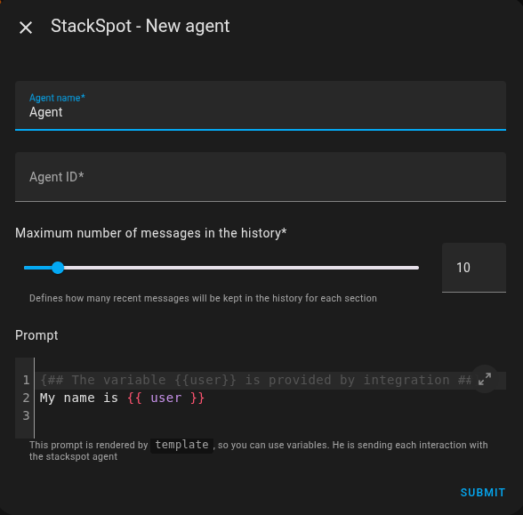
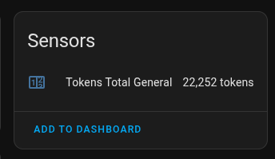

# Integration StackSpot AI with Home Assistant


[](https://my.home-assistant.io/redirect/hacs_repository/?owner=alves-dev&repository=stackspot-homeassistant&category=integration)

## 📋 Changelog

See all changes in [CHANGELOG.md](./CHANGELOG.md)

### What is it
This is an integration of [Home Assistant](https://www.home-assistant.io) to connect to the [Stackspot AI](https://stackspot.com/en) platform, 
Which is a platform of AI, where you can easily create your custom agents with various different models.

### Requirement
Just have an account on the Stackspot platform: [Create Freemium Account](https://ai.stackspot.com)

### Functionality
Allows you to create multiple agents for the same account and have a control over the use of tokens.


### Installation
Integration can be adding via HACS, just click the following button:

[](https://my.home-assistant.io/redirect/hacs_repository/?owner=alves-dev&repository=stackspot-homeassistant&category=integration)


### Settings
After adding and installing the integration, set up with:




- `Account name` and `Agent name`: Are free text
- `realm`: For account freemium use `stackspot-freemium`
- `client_id` and `client_key`: Are credentials to access your account, and can be purchased [here](https://myaccount.stackspot.com/profile/access-token).
- `agent`: ID of the agent you want to use, [here](https://www.linkedin.com/pulse/seu-agente-de-ia-do-jeito-igor-moreira-nhu6f/) you can see how to create one.
- `Maximum number of messages in the history`: Defines how many recent messages will be kept in the history for each section
- `Prompt`: A template that becomes an additional prompt for the agent. Note that the variable `user` is provided by integration.
  - List of provided variables available:
    - `user` - Logged user name

You can have multiple agents, see:


---
### Assistant

Now you can go to `Assistants` and click `+ ADD ASSISTANT`:

[](https://my.home-assistant.io/redirect/voice_assistants/)

In the listing the options will be the name of the agent + `Conversation`:


After created just use the shortcut `a` that the conversation interface will be opened:


With each interaction with the agent the tokens will be accounted for in the sensors,
and the general sensor:




### Flow


### Debug

To debug the integration, you must add the following lines to the configuration file:

```yaml
logger:
  default: info
  logs:
    custom_components.stackspot: debug
```

### Limitations

At the moment the integration is not yet able to access their entities, as well as will not be able to change status of their entities.